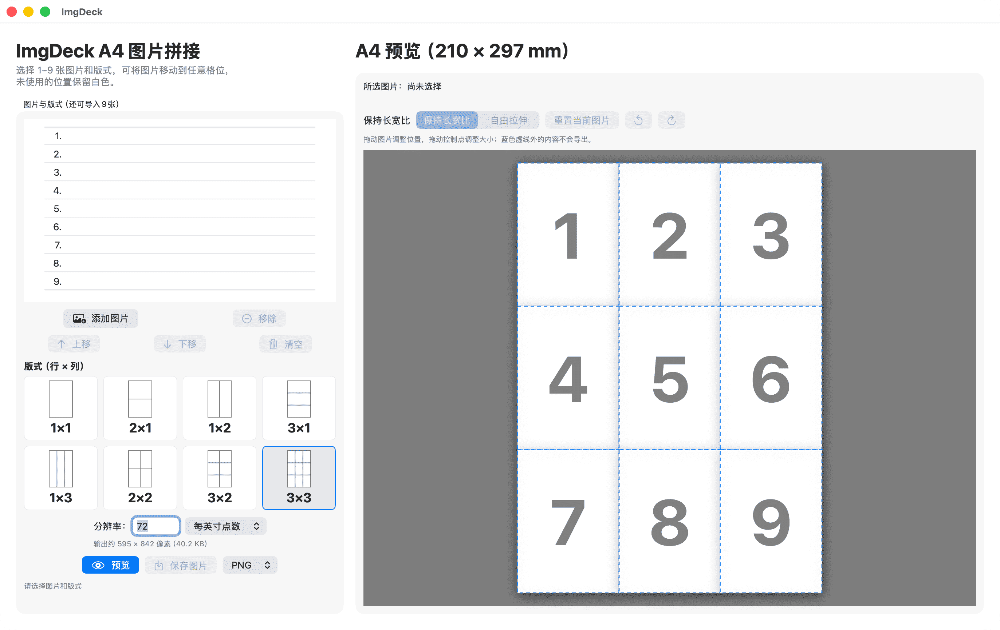

# ImgDeck

ImgDeck 是使用 SwiftUI 开发的原生 macOS A4 图片排版工具，基于开源项目 `imgcom` 的功能思路重新实现。图片导入、版式选择、预览和保存均在图形界面中完成。

## 软件界面



## 支持与隐私

- [技术支持](docs/support.md)
- [隐私政策](docs/privacy.md)
- [Mac App Store 发布资料](app-store/README.md)

## 项目来源

本项目基于 [makalin/imgcom](https://github.com/makalin/imgcom)
修改和扩展。原项目由 Mehmet T. AKALIN 开发，本版本的后续修改
和维护由李自立完成。

## 功能

- 1×1、2×1、1×2、3×1、1×3、2×2、3×2、3×3 共 8 种 A4 版式
- 支持导入、排序和移除 1–9 张图片
- 图片保持原始长宽比并完整显示，未填充区域使用白色背景
- 支持每英寸点数和每厘米点数两种分辨率单位
- 实时显示输出像素尺寸和预计文件大小
- 支持 PNG、JPG 保存，默认 PNG
- 调整分辨率时保留当前预览，重新预览后应用新尺寸
- 支持简体中文、繁体中文和英文，可在软件设置中即时切换
- 可在 A4 预览中逐张拖动和缩放图片，蓝色虚线标示每个格子的裁剪边界
- 支持保持长宽比和自由拉伸两种编辑方式，并可重置、撤销或重做调整

## 开发与构建

项目位于 `macos/`，不依赖 Python、OpenCV、NumPy 或 Pillow。当前目标为 Apple Silicon，最低支持 macOS 13。开发环境需要完整安装 Xcode。

使用 Xcode 打开工程：

```bash
open macos/ImgDeck.xcodeproj
```

在 Xcode 中选择 `ImgDeck` Scheme 和 `My Mac`，点击左上角三角形按钮或按 `⌘R`，即可构建并运行 Debug 版本。Xcode 生成的 App 位于其 DerivedData 目录中的 `Build/Products/Debug/ImgDeck.app`，可通过 `Product → Show Build Folder in Finder` 查看。

运行 Swift 单元测试：

```bash
xcodebuild -project macos/ImgDeck.xcodeproj -scheme ImgDeck \
  -configuration Debug -destination 'platform=macOS,arch=arm64' \
  -derivedDataPath build/swift CODE_SIGNING_ALLOWED=NO test
```

准备提交 Mac App Store 时，请使用 Xcode 的 `Product → Archive` 创建正式归档，不要直接提交 Debug App。

## 使用方法

1. 如需切换语言，打开菜单栏中的 `ImgDeck → 设置…`，选择简体中文、繁体中文或 English；选择会立即生效并自动保留。
2. 点击“添加图片”导入图片，并用“上移”“下移”调整顺序。
3. 选择 A4 版式；图片按编号顺序填入，超出容量的图片不显示。
4. 在右侧预览中点击图片格，拖动图片调整显示位置，拖动控制点调整大小；蓝色虚线外的内容不会导出。
5. 根据需要选择“保持长宽比”或“自由拉伸”。可点击“重置当前图片”恢复默认，使用 `⌘Z`/`⇧⌘Z`撤销或重做。
6. 设置分辨率与单位，点击“预览”。
7. 选择 PNG 或 JPG，点击“保存图片”。

## 项目结构

```text
imgdeck/
├── app-store/          # App Store 文案、审核说明与截图清单
├── assets/             # README 截图与应用图标源文件
├── docs/               # GitHub Pages 隐私政策与技术支持页面
├── macos/              # SwiftUI 源码、Xcode 工程与单元测试
├── README.md
└── LICENSE
```

## 开源说明

本项目基于 Mehmet T. AKALIN 的开源项目 `imgcom` 修改，继续采用 MIT License。
