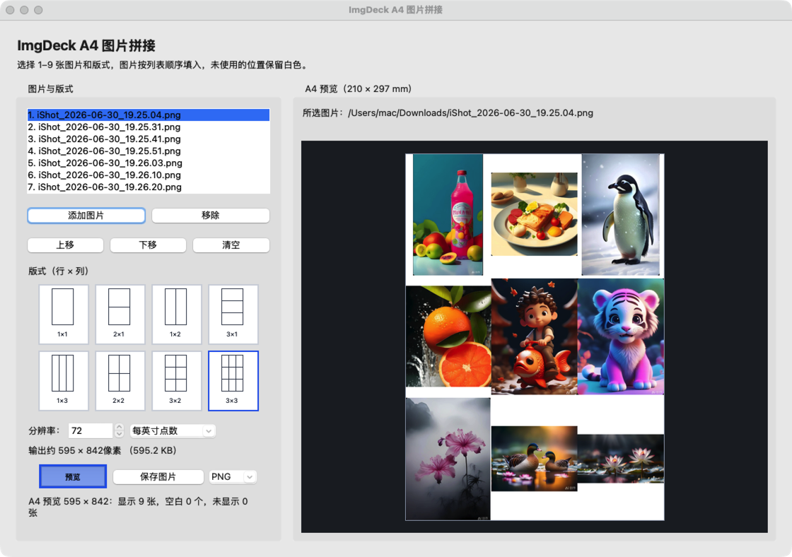

# ImgDeck

ImgDeck 是一个纯图形界面的 A4 图片排版工具，基于开源项目 `imgcom` 改造。图片导入、版式选择、预览和保存均在 GUI 中完成，不再提供命令行拼接功能。

## 软件界面



## 项目来源

本项目基于 [makalin/imgcom](https://github.com/makalin/imgcom)
修改和扩展。原项目由 Mehmet T. AKALIN 开发，本版本的后续修改
和维护由“你的姓名或组织名称”完成。

## 功能

- 1×1、2×1、1×2、3×1、1×3、2×2、3×2、3×3 共 8 种 A4 版式
- 支持导入、排序和移除 1–9 张图片
- 图片保持原始长宽比并完整显示，未填充区域使用白色背景
- 支持每英寸点数和每厘米点数两种分辨率单位
- 实时显示输出像素尺寸和预计文件大小
- 支持 PNG、JPG 保存，默认 PNG
- 调整分辨率时保留当前预览，重新预览后应用新尺寸

## 环境与启动

需要 Python 3.9 或更高版本。建议在 Conda 环境中安装依赖：

```bash
python3 -m pip install -r requirements.txt
python3 imgdeck.py
```

程序启动后，所有图片处理均在图形界面内完成，无需输入任何拼接命令。

## 运行测试

`tests/` 目录存放项目的核心功能回归测试，用于验证 A4 输出尺寸、图片排版、空白区域填充、图片数量限制以及 PNG/JPG 保存等功能。修改图像处理逻辑后，建议运行测试，确认现有功能没有受到影响。

先安装项目依赖，然后在项目根目录（即包含 `imgdeck.py` 的目录）执行：

```bash
python3 -m pip install -r requirements.txt
python3 -m unittest discover -s tests -v
```

测试文件会自动定位项目根目录，因此也可以在项目根目录直接运行：

```bash
python3 tests/test_imgdeck.py
```

或者进入 `tests` 目录后运行：

```bash
cd tests
python3 test_imgdeck.py
```

如果系统中安装了多套 Python，请始终使用同一个解释器安装依赖和运行测试。采用 `python3 -m pip`，可以避免 `pip` 与 `python3` 指向不同环境。

## 使用方法

1. 点击“添加图片”导入图片，并用“上移”“下移”调整顺序。
2. 选择 A4 版式；图片按编号顺序填入，超出容量的图片不显示。
3. 设置分辨率与单位，点击“预览”。
4. 选择 PNG 或 JPG，点击“保存图片”。

## 项目结构

```text
imgdeck/
├── assets/             # README 使用的界面截图
├── imgdeck.py          # GUI 与图像处理
├── tests/              # 核心功能测试
├── README.md
├── requirements.txt
├── pyproject.toml
└── LICENSE
```

## 开源说明

本项目基于 Mehmet T. AKALIN 的开源项目 `imgcom` 修改，继续采用 MIT License。
